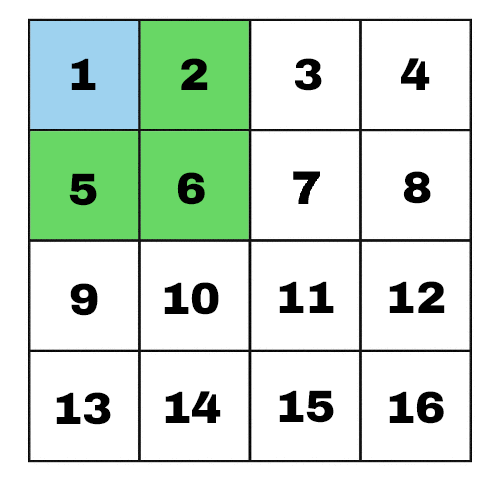

# Grid neighbor finder



Library returns the neighbors of a grid represented as a 2D array **without** wrapping.

## Installing

```
npm i 2d-grid-neighbors
```

## Usage

Getting the **values** of the neighbors:

```typescript
const grid = [
    'a', 'b', 'c', 'd',
    'd', 'e', 'f', 'g',
    'h', 'i', 'j', 'k',
    'l', 'm', 'n', '0',
];

const getNeighborsForIndex = 5;
const result = getNeighbors(grid, getNeighborsForIndex);

// result: ['a', 'b', 'c', 'd', 'f', 'h', 'i', 'j']
```

If you need the indices, use ``getNeighborIndices()``.

This library works for a grid of any size provided that the grid has an equal number of columns and rows.
